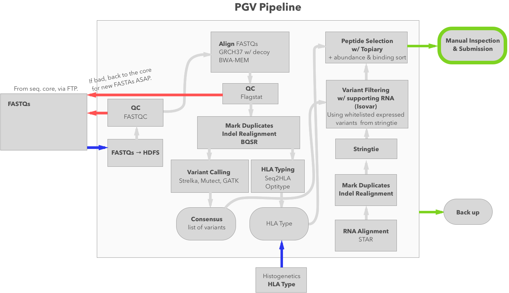

# Epidisco

Epidisco is a highly-configurable genomic pipeline. It supports alignment, the
GATK, variant calling, epitope discovery, and vaccine generation.

It uses [Biokepi](https://github.com/hammerlab/biokepi) to construct
[Ketrew](https://github.com/hammerlab/ketrew) workflows which can be scheduled
on many kinds of clusters.

## Usage

Documentation on Biokepi workflows is centralized in the project
[`hammerlab/wobidisco`](https://github.com/hammerlab/wobidisco); a good starting
point is the “Running Local”
[tutorial](https://github.com/hammerlab/wobidisco/blob/master/doc/running-local.md).

## Note on Multiple Samples

You can pass multiple samples into Epidisco, but they will be merged into one
sample (tumor, normal, or tumor RNA) after the alignment & mark duplicates
step. This option to process multiple samples should only be used to e.g. pass
data from biological replicates (or samples you wish to treat as such) into the
pipeline, which fundamentally operates on a tumor, normal, and tumor RNA sample
set.

